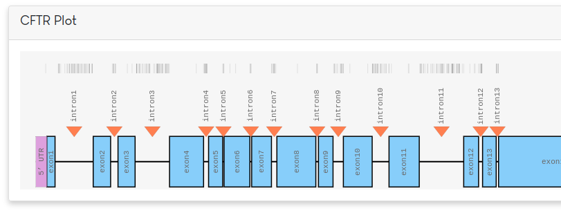
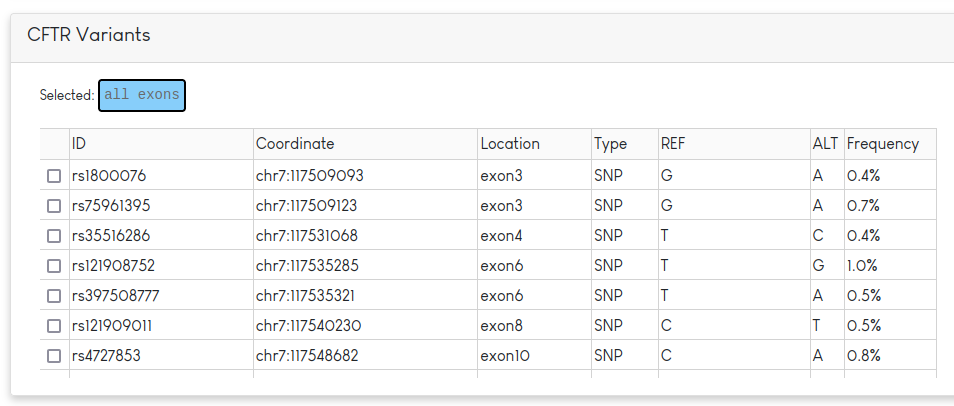
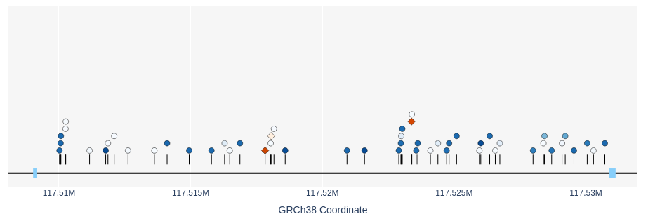
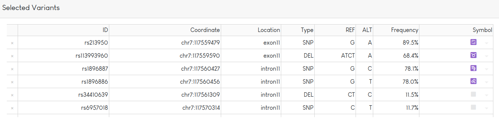
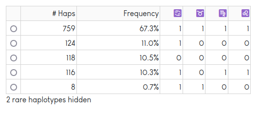

.. figure:: resources/logo.svg
   :target: index.html
   :width: 300px
   :height: 150px
   :alt: logo

A web application for understanding CFTR haplotypes. The software is `available here <https://cftbarcode.research.sickkids.ca/>`_ 

Documentation for CFTbaRcodes
==================================

The first panel of the software shows a plot of the *CFTR* gene.

Along the top of the figure, known variants are plotted as small vertical black lines. Different parts of the gene can be selected for further exploration. By default, all exons are selected. Based on the selection, a table of variants will be shown in a panel below.

This table lists information regarding the rsID, position, REF/ALT and frequency of the variant in the dataset. In addition to the table, the variants from the table plotted by coordinate. SNPs are drawn as blue circles and indels appear as orange diamonds. The allele frequency of each variant is indicated by the darkness of the colour (darker = more common). 

Variants can be selected by either the checkbox on the table view or by clicking the shape in the plotted view. Selected variants appear in the below panel.

Variant information is displayed in the table. Variants can be tagged with one of a set of predefined symbols (shown in last column). After clicking on the "Redraw Plot" button, variants tagged with a symbol will be shown in a haplotype table:

.. figure:: resources/redraw_button.png

The haplotype table shows a count and frequency for each unique haplotype observed in the dataset. Rare haplotypes are hidden to protect privacy. The "Redraw Plot" button also generates a `textile plot <https://journals.plos.org/plosone/article?id=10.1371/journal.pone.0010207>`_:

.. figure:: resources/textile_plot.png

In this plot, variants are shown in columns, lines connect alleles that are found on the same haplotype. The thicker the line, the more frequent a pair of alleles is found on the same haplotype. The plot optimized the vertical position of each allele such that alleles more often found on the same haplotype are aligned horizontally. More details can be found in the `textile plot paper <https://journals.plos.org/plosone/article?id=10.1371/journal.pone.0010207>`_.

Selecting a haplotype in the haplotype table highlights the corresponding path on the plot in red. Hovering over each variant provides frequency information.

The code is `freely available on GitHub <https://github.com/strug-hub/CFTbaRcodes>`_ 

